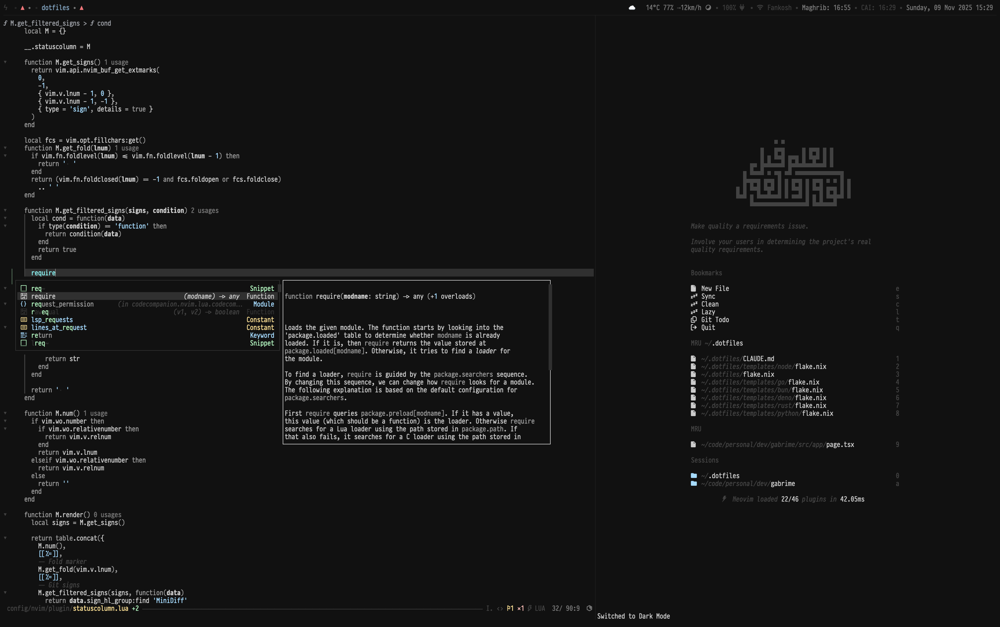

# ~ 🍭 ~

[](https://builtwithnix.org)

A Nix-flake-powered personal workstation setup for Unix machines.

This repository is the single source of truth for most of my system
configuration: operating system settings, packages, shell, editor, terminal,
automation, mail, and day-to-day development tooling. The main target is Apple
Silicon macOS using [nix-darwin][nix-darwin] + [Home Manager][home-manager],
with an experimental [NixOS][nix] host as well.

It is a personal setup first, but the structure is meant to stay reusable: hosts
are composed from small feature modules, app configs live in
[config/](./config/), and new machines can be bootstrapped with a single
`nix run` command.



> Font is [Pragmata Pro](https://fsd.it/shop/fonts/pragmatapro/), theme is
> [my own](./config/nvim/colors/plain.lua) fork of
> [vim-colors-plain](./config/nvim/colors/plain.lua), Terminal is
> [Ghostty][ghostty].

> [!NOTE]
>
> `Pragmata Pro` is a commercial font and is **not** bundled with this repo.
> This flake expects a `PragmataPro<version>.zip` archive to be available in the
> Nix store. See [Font prerequisite](#2-font-prerequisite).

## What this repo manages

The repo is split between reusable Nix modules in [nix/](./nix/) and checked-in
application configuration in [config/](./config/). In practice it manages:

| Area                    | What is configured here                                                                           |
| ----------------------- | ------------------------------------------------------------------------------------------------- |
| System management       | Nix, flake-parts, Home Manager, nix-darwin, host definitions, overlays, and small custom packages |
| Shell and terminal      | Zsh, tmux, Ghostty, Kitty, direnv, atuin, zoxide, eza, fzf, bat, ripgrep, and Yazi                |
| Editor and coding tools | Neovim, formatters, language servers, and Node/Bun/Python/Go/Rust tooling                         |
| Source control          | Git, Jujutsu, gh, gh-dash, tig, and delta                                                         |
| macOS automation        | Hammerspoon, Karabiner-Elements, system defaults, and window management                           |
| Mail and communication  | aerc, isync/mbsync, notmuch, msmtp, and pass                                                      |
| Notes and media         | zk, mpv, and yt-dlp                                                                               |
| AI / agent tooling      | Claude, Pi, Codex, OpenCode, `sb`, and related llm-agents tooling/config                          |

## Supported targets

These are the targets currently represented in the flake:

| System           | Status                                               | Hosts                                                                          |
| ---------------- | ---------------------------------------------------- | ------------------------------------------------------------------------------ |
| `aarch64-darwin` | Primary target, actively used on Apple Silicon macOS | [rocket](./nix/parts/hosts/rocket/), [alcantara](./nix/parts/hosts/alcantara/) |
| `x86_64-linux`   | Experimental NixOS host                              | [nixos](./nix/parts/hosts/nixos/)                                              |

If you do not pass a host during bootstrap, the scripts default to
`$(hostname -s)`.

## Repository layout

The repo is organized around a small number of top-level directories:

| Path                       | Purpose                                                                                                                              |
| -------------------------- | ------------------------------------------------------------------------------------------------------------------------------------ |
| [config/](./config/)       | Checked-in application configs for Neovim, tmux, git, Ghostty, Kitty, Yazi, aerc, Hammerspoon, Karabiner, Claude/Pi config, and more |
| [nix/](./nix/)             | Flake composition, reusable modules, host definitions, overlays, custom packages, and encrypted/private files                        |
| [scripts/](./scripts/)     | Bootstrap scripts used by `nix run` for macOS and NixOS                                                                              |
| [templates/](./templates/) | Small flake templates for starting new projects                                                                                      |

Inside [nix/](./nix/), the interesting pieces are:

| Path                                                     | Purpose                                                                                     |
| -------------------------------------------------------- | ------------------------------------------------------------------------------------------- |
| [nix/parts/hosts/](./nix/parts/hosts/)                   | Per-machine host definitions                                                                |
| [nix/parts/modules/shared/](./nix/parts/modules/shared/) | Reusable features such as `shell`, `git`, `vim`, `mail`, `yazi`, `ai`, `node`, and `python` |
| [nix/parts/modules/darwin/](./nix/parts/modules/darwin/) | macOS-only modules such as defaults, Hammerspoon, and Karabiner                             |
| [nix/parts/outputs/](./nix/parts/outputs/)               | Flake outputs like apps, templates, overlays, formatter, and dev shells                     |
| [nix/pkgs/](./nix/pkgs/)                                 | Small custom packages and overrides used by the configuration                               |
| [nix/secrets/](./nix/secrets/)                           | age-encrypted or private inputs used by the setup                                           |

The overall pattern is simple: a host declares a list of features such as
`shell`, `git`, `vim`, `mail`, or `ai`, and the flake wires in the matching
system and Home Manager modules automatically.

## Installation

### 1. Install Nix

I use the new Nix installer:

> [!WARNING]
>
> Before installing, check the
> [`quirks`](https://github.com/NixOS/nix-installer/blob/main/docs/quirks.md)
> section.

```bash
curl --proto '=https' --tlsv1.2 -sSfL https://artifacts.nixos.org/nix-installer | sh -s -- install
```

### 2. Font prerequisite

This setup installs `Pragmata Pro` through a custom Nix package that uses
`requireFile`. If you own the font, add the archive to the Nix store before the
first rebuild:

```bash
nix-store --add-fixed sha256 /path/to/PragmataPro<version>.zip
```

If you do not use `Pragmata Pro`, remove or replace `pkgs.pragmatapro` in the
flake before bootstrapping.

### 3. Bootstrap a machine

Run the repo directly from GitHub:

```bash
nix --experimental-features 'nix-command flakes' run 'github:ahmedelgabri/dotfiles' -- <host>
```

> [!IMPORTANT]
>
> The value after `--` is the host name consumed by the bootstrap app, not a
> flake reference like `.#rocket`.

In my setup the host is usually the machine hostname. If omitted, it falls back
to `$(hostname -s)`.

Examples:

```bash
# macOS hosts
nix --experimental-features 'nix-command flakes' run 'github:ahmedelgabri/dotfiles' -- rocket
nix --experimental-features 'nix-command flakes' run 'github:ahmedelgabri/dotfiles' -- alcantara

# NixOS host
nix --experimental-features 'nix-command flakes' run 'github:ahmedelgabri/dotfiles' -- nixos
```

On the first run, the bootstrap app:

| Step | What happens                                          |
| ---- | ----------------------------------------------------- |
| 1    | Uses the flake source it was launched from            |
| 2    | Applies the selected host configuration               |
| 3    | Clones the repo into `~/.dotfiles` for later rebuilds |
| 4    | Reuses the local clone on subsequent runs             |

Platform-specific behavior:

| Platform                 | Behavior                                                                                                                |
| ------------------------ | ----------------------------------------------------------------------------------------------------------------------- |
| macOS (`aarch64-darwin`) | Installs Xcode Command Line Tools if missing, installs Rosetta when needed, then switches the system using `nix-darwin` |
| Linux (`x86_64-linux`)   | Expects `nixos-rebuild` to exist already, then switches the system using `nixos-rebuild`                                |

### 4. Rebuild after the first install

Once the repo is cloned locally, rebuild from `~/.dotfiles`.

#### macOS

```bash
cd ~/.dotfiles
nixup   # helper for `nix flake update`
nixsw   # helper for `darwin-rebuild switch --flake .`
```

Equivalent manual command:

```bash
darwin-rebuild switch --flake ~/.dotfiles#<host>
```

#### NixOS

```bash
cd ~/.dotfiles
nixup   # optional helper for `nix flake update`
sudo nixos-rebuild switch --flake .#nixos
```

## Homebrew on macOS

I still use [Homebrew][homebrew] mainly for GUI apps.

Nix and/or Home Manager support for GUI applications on macOS is still a bit
awkward, especially around symlinking into `Applications/`. Homebrew is still
managed declaratively here, but it is installed and controlled through
[`nix-homebrew`][nix-homebrew] rather than manually.

It also covers a few macOS-only dependencies that are awkward to source through
Nix alone, such as `Tart`, which backs the `sb` sandbox helper.

## Machine-local configuration

Not everything belongs in Git. This repo intentionally keeps some values outside
of the tracked tree and loads them from a host-specific location.

Home Manager sets a per-host config directory under `${XDG_DATA_HOME}`, and in
my shell that path is exposed as `$HOST_CONFIGS`.

In practice this usually means something like:

```text
$HOST_CONFIGS = ~/.local/share/<host>
```

Useful files to create there:

| Path                                       | Purpose                                                                                                                      | Example                  |
| ------------------------------------------ | ---------------------------------------------------------------------------------------------------------------------------- | ------------------------ |
| `$HOST_CONFIGS/zshrc`                      | Tokens and machine-local shell setup                                                                                         | `export GITHUB_TOKEN=`   |
| `$HOST_CONFIGS/gitconfig`                  | Local Git settings that should not be committed, especially GPG signing details                                              | `[user] signingkey =`    |
| `$HOST_CONFIGS/hammerspoon/<hostname>.lua` | Machine-specific Hammerspoon extras loaded alongside the checked-in config in [config/.hammerspoon/](./config/.hammerspoon/) | Host-specific Lua config |

If you want GitHub to show commits as **Verified**, the email on the commit, the
email on GitHub, and the email attached to the public key all need to match.

Also remember to:

- generate SSH keys
- import or create your GPG keys
- upload the public GPG key to GitHub if you use commit signing

## Secrets and private data

This repo includes [`agenix`][agenix], but I do **not** use it as the source of
truth for important secrets.

The rough rule here is:

- truly sensitive credentials are generated or imported per machine and stored
  in [`pass`][pass]
- `agenix` is used only for lower-risk private files that I still want to keep
  out of the public repo

## Email setup

Mail is one of the more opinionated parts of this setup.

The stack looks like this:

| Component                   | Role                      |
| --------------------------- | ------------------------- |
| [`isync` / `mbsync`][isync] | Synchronizes mail         |
| [`notmuch`][notmuch]        | Indexes and searches mail |
| [`aerc`][aerc]              | Mail client               |
| `msmtp`                     | Handles outgoing mail     |
| [`pass`][pass]              | Stores credentials        |

The mail module currently has service defaults for:

| Service        |
| -------------- |
| `fastmail.com` |
| `gmail.com`    |
| `cirrux.me`    |

It also supports two modes:

| Mode     | Behavior                                                           |
| -------- | ------------------------------------------------------------------ |
| `local`  | Mail is synced to local Maildir folders and indexed with `notmuch` |
| `remote` | `aerc` connects directly to the remote service                     |

When local accounts are enabled, synchronization runs automatically:

| Platform | Scheduler              |
| -------- | ---------------------- |
| macOS    | `launchd`              |
| NixOS    | `systemd --user` timer |

The timer runs every 2 minutes in this setup.

### Authentication

Each account needs authentication for IMAP and SMTP. Some services also need
extra credentials for JMAP or CardDAV.

Passwords are read from [`pass`][pass]. For an account named `Foo`, the module
expects entries under the lowercased account name:

| Entry                        | Used for                      |
| ---------------------------- | ----------------------------- |
| `service/email/foo/password` | IMAP/SMTP password            |
| `service/email/foo/source`   | Fastmail/JMAP source access   |
| `service/email/foo/outgoing` | Fastmail/JMAP outgoing access |
| `service/email/foo/contacts` | Fastmail/CardDAV access       |

With two-factor authentication enabled, use an app-specific password where
needed.

## Flake templates

This repo also exports a few project templates from [templates/](./templates/).

Use them like this:

```bash
nix flake init --template 'github:ahmedelgabri/dotfiles#<template name>'
```

or:

```bash
nix flake init --template 'github:ahmedelgabri/dotfiles#<template name>' ./my-project
```

`-t` can be used as a shorthand for `--template`.

Available templates:

| Template        | Description                                                  |
| --------------- | ------------------------------------------------------------ |
| `default`       | Empty flake template                                         |
| `node`          | Simple Node / JS / TS template using `pnpm`                  |
| `deno`          | Simple Deno template                                         |
| `bun`           | Simple Bun template                                          |
| `python`        | Simple Python project template                               |
| `python-script` | Simple one-off Python script template using `uv` script mode |
| `go`            | Simple Go template                                           |
| `rust`          | Simple Rust template                                         |

## Working on this repo

The flake also exposes a few outputs that are useful when editing the dotfiles
repo itself:

| Command            | What it does                           |
| ------------------ | -------------------------------------- |
| `nix develop`      | Provides the default development shell |
| `nix fmt`          | Formats the Nix code with `alejandra`  |
| `nix develop .#go` | Opens the Go-focused dev shell         |

<!-- Reference links -->

[aerc]: https://aerc-mail.org/
[agenix]: https://github.com/ryantm/agenix
[ghostty]: https://ghostty.org/
[home-manager]: https://github.com/nix-community/home-manager
[homebrew]: https://brew.sh/
[isync]: https://isync.sourceforge.io/
[nix]: https://nixos.org/
[nix-darwin]: https://github.com/nix-darwin/nix-darwin
[nix-homebrew]: https://github.com/zhaofengli/nix-homebrew
[notmuch]: https://notmuchmail.org/
[pass]: https://www.passwordstore.org/
