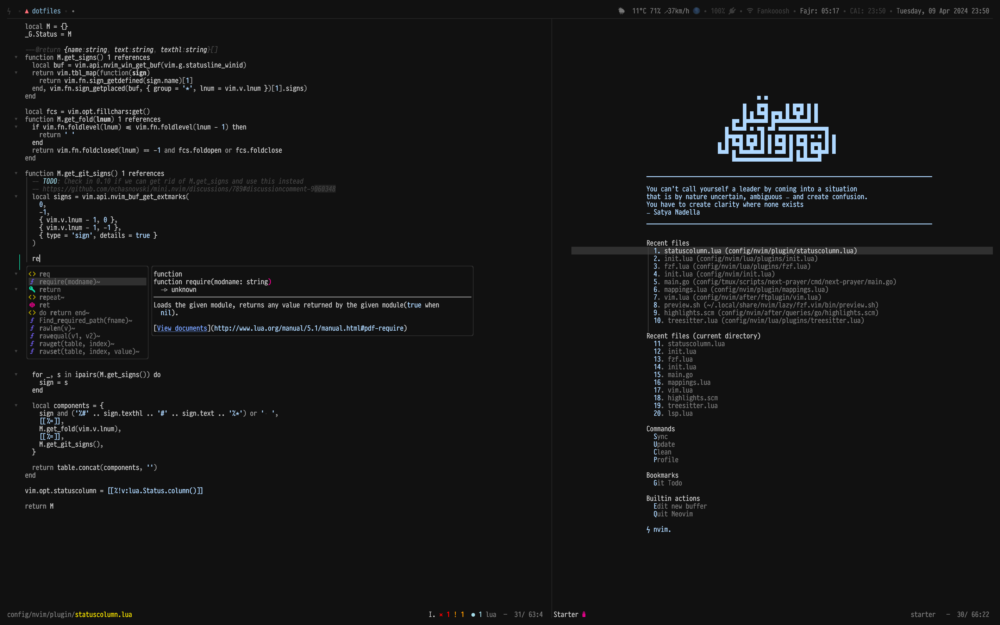

# ~ 🍭 ~

[](https://builtwithnix.org)

For setting up development environment on any Unix machine (Darwin/Linux). The
config officially supports macOS & NixOS & managed by [nix][nix]



> _Font is [Pragmata Pro](https://fsd.it/shop/fonts/pragmatapro/), theme is a
> [my own](./config/nvim/colors/plain.lua) fork of
> [vim-colors-plain](https://github.com/andreypopp/vim-colors-plain), Terminal
> is [kitty](https://sw.kovidgoyal.net/kitty/)_

## What's in it?

These are the main configs:

- [nix][nix] to manage installing most of the dependencies, for GUI apps on
  macsOS I'm still using
  [Homebrew cask](https://github.com/caskroom/homebrew-cask) through the
  homebrew module in
  [`nix-darwin`](https://github.com/LnL7/nix-darwin/blob/5c3146b75d5d478f0693d0ea6c83f1da8382ff56/modules/homebrew.nix)
- [neomutt][neomutt] for reading emails
- [tmux][tmux] 2.3 or later
- [Neovim][neovim]
- [Zsh][zsh]
- [Git][git]
- [Kitty][kitty] as my terminal
- [weechat][weechat] IRC client
- [hammerspoon][hammerspoon] macOS automation, using it for window management &
  other stuff

## Officially supported OSs

- Intel macOS Monterey
- ARM macOS Ventura
- [Experimental] NixOS (tested on 22.11)

## Installation

1. Install Command line tools.

```bash
xcode-select --install
```

2. Run the following command

```bash
bash -c "$(curl -fsSL https://raw.github.com/ahmedelgabri/dotfiles/master/install)"
```

### Notes

- zsh: add these to `${XDG_DATA_HOME}/$(hostname)/zshrc`

```zsh
export HOMEBREW_GITHUB_API_TOKEN =
export GITHUB_TOKEN =
export WEECHAT_PASSPHRASE =
```

- For git add your GPG key info in `${XDG_DATA_HOME}/$(hostname)/gitconfig`

```
[user]
  signingkey =
```

Don't forget to upload your public key to
[GitHub](https://github.com/blog/2144-gpg-signature-verification)!

> Note: There needs to be a three-way match on your email for GitHub to show the
> commit as 'verified': The commit email, github email, & the email associated
> with the public key

Learn about creating a GPG key and signing your commits
[here](https://git-scm.com/book/en/v2/Git-Tools-Signing-Your-Work)

#### Email

My email messages are synchronised between the remote server and my computer
with [isync][isync], I read them with [neomutt][neomutt] and search index is
built by [notmuch][notmuch].

After linking the dotfiles, there are only a few more things that need to be
done.

##### Authentication

Each account must authenticate with an IMAP server and an SMTP server. The
passwords, need be stored in the [OS X keychain][keychain].

For Fastmail (or Gmail accounts with two-factor authentication enabled), use an
application-specific password.

In order for all this to work, a few items have to be stored in the macOS
keychain:

Create a "generic"(A.K.A. "application") keychain item (that is, without
protocols, only hostnames):

For sending mail:

- An item with:
  - "Keychain Item Name": fastmail.com
  - "Account Name": username+mutt@fastmail.com

**Repeat this for each account you want to add.**

## Synchronizing periodically

Incoming messages are fetched from the remote server when `mbsync` runs (the
executable name for isync).

On macs I use [`launchd`][launchd], on NixOS using `systemd`. You can check
[`mail.nix`](nix/modules/shared/mail.nix).

### Authors

[Ahmed El Gabri](https://twitter.com/AhmedElGabri)

[isync]: http://isync.sourceforge.net
[notmuch]: https://notmuchmail.org
[keychain]: https://en.wikipedia.org/wiki/Keychain_(software)
[launchd]: http://launchd.info
[neomutt]: https://neomutt.org/
[nix]: https://nixos.org/
[tmux]: http://tmux.sourceforge.net/
[neovim]: https://neovim.io
[zsh]: http://www.zsh.org/
[git]: http://git-scm.com/
[kitty]: https://github.com/kovidgoyal/kitty
[weechat]: https://weechat.org/
[hammerspoon]: http://www.hammerspoon.org/
[node]: https://nodejs.org
[python]: https://www.python.org/
