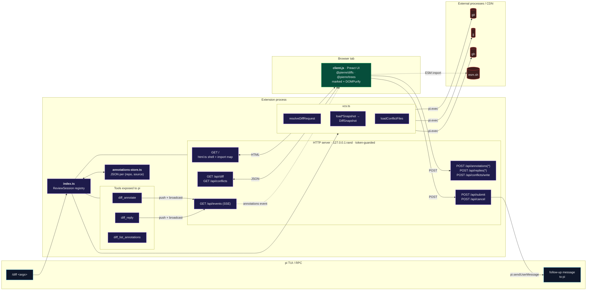
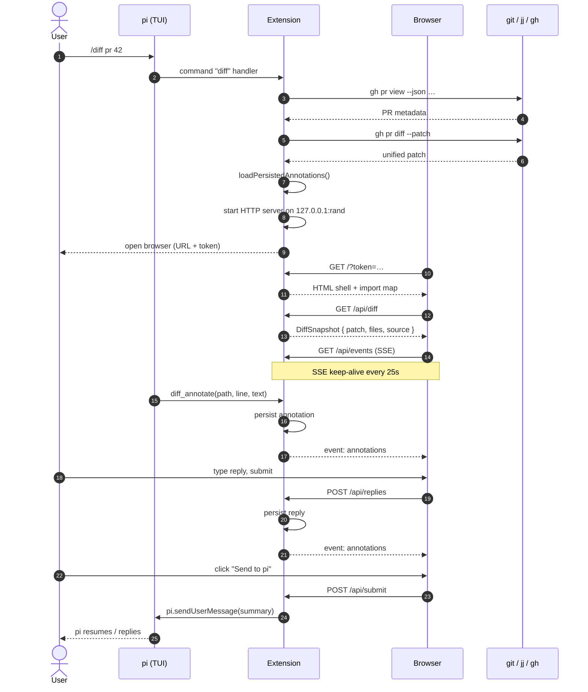

# `/diff` — Browser-Based Diff Review Extension

A pi coding-agent extension that opens any diff (working tree, git ref, git
range, jj revision, or GitHub pull request) in a local browser tab with a live,
bidirectional annotation channel between the user and pi. Annotations are
persisted on disk per repo + diff source, so closing and re-opening the same
diff restores the previous review.

## TL;DR

- Run `/diff` to review the current working diff.
- Run `/diff <ref>`, `/diff pr <n>`, `/diff jj <revset>`, or paste a GitHub
  PR/commit URL to review anything else.
- A localhost HTTP server boots, your browser opens, and the agent and you can
  drop comments on specific lines that both sides see immediately.
- When you click **Send to pi**, every annotation + an optional cover note is
  delivered to pi as a follow-up message.
- Annotations persist under `$PI_CODING_AGENT_DIR/diff/<repo>/<source>.json`.

## Why this exists

pi already has solid CLI ergonomics for code review, but reading a 2000-line
diff in a chat window is painful. This extension delegates rendering to a real
browser (using [`@pierre/diffs`](https://www.npmjs.com/package/@pierre/diffs)
for syntax-aware rendering and
[`@pierre/trees`](https://www.npmjs.com/package/@pierre/trees) for the file
tree), while keeping pi as the active reviewer that can drop comments, reply to
yours, and react to your final review notes.

## High-level architecture



The extension never proxies the diff through pi's chat history; it talks to
git/jj/gh directly via `pi.exec(...)` and streams everything to a sandboxed
local server. Only the final review summary is injected into the conversation.

## End-to-end sequence



## File layout

| File                   | Role                                                                                                                                                                                        |
| ---------------------- | ------------------------------------------------------------------------------------------------------------------------------------------------------------------------------------------- |
| `index.ts`             | Extension entrypoint. Registers the `/diff` command, the three `diff_*` tools, manages `ReviewSession`s, and serves the HTTP API.                                                           |
| `vcs.ts`               | Source-of-truth for "where does the patch come from": parses `/diff` args, dispatches to `jj`, `git`, or `gh`, parses unified-diff headers into `DiffFile[]`, and surfaces merge conflicts. |
| `annotations-store.ts` | On-disk persistence. Per-repo, per-source JSON files with atomic rename + legacy single-file migration.                                                                                     |
| `prefs.ts`             | On-disk UI preferences (sidebar widths). A single global JSON file with atomic rename; survives the random server port that defeats browser `localStorage`.                                  |
| `html.ts`              | Tiny HTML shell with an `importmap` that pulls Preact, htm, marked, DOMPurify, `@pierre/diffs`, and `@pierre/trees` from `esm.sh`. Inlines `client.js` and `styles.css`.                    |
| `client.js`            | Preact UI: file tree, diff renderer, annotation threads, merge-conflict editor, SSE wiring. Shipped as plain JS so no build step is needed.                                                 |
| `styles.css`           | UI styling (light/dark via `light-dark()`).                                                                                                                                                 |

## Browser sidebar controls

The file sidebar supports keyboard navigation when it has focus: `j` opens the next edited file and `k` opens the previous edited file. If the target file is inside a collapsed folder, its parent folders are expanded automatically. The sidebar toolbar also has **Collapse all** and **Open all** buttons for large trees.

Both sidebars are resizable by dragging their dividers (or focusing a divider and using the arrow keys). Because the server binds a fresh random port every session, `localStorage` — which is origin-scoped — would reset each time, so the widths are persisted server-side via `POST /api/prefs` and seeded back into the page on load.

## The `/diff` command

`/diff [args…]` accepts several forms. They are resolved in order, with the
first match winning:

| Form                                                                                             | Meaning                                                                                                             |
| ------------------------------------------------------------------------------------------------ | ------------------------------------------------------------------------------------------------------------------- |
| `/diff`                                                                                          | Working diff. Prefers `jj diff --git` if inside a jj repo, otherwise `git diff HEAD`.                               |
| `/diff <flags…>`                                                                                 | Same as above; remaining args are forwarded to the underlying VCS (e.g. `/diff -- src/`).                           |
| `/diff pr [target]`                                                                              | GitHub PR via `gh pr diff [target] --patch`. `target` may be `123`, `#123`, `pull/123`, a branch name, or a PR URL. |
| `/diff <github-pull-url>`                                                                        | Same as above; URL is detected automatically.                                                                       |
| `/diff #123` / `/diff 123`                                                                       | Bare PR number. `123` is also tried as a PR if it is not a valid git ref.                                           |
| `/diff ref <ref>` / `/diff commit <ref>` / `/diff show <ref>`                                    | `git show <ref>` for commits, `git diff <range>` for `A..B` / `A...B`.                                              |
| `/diff <ref>`                                                                                    | Auto-detected: tries jj revset, then git ref, then PR number.                                                       |
| `/diff jj <revset>` / `/diff rev <revset>` / `/diff revision <revset>` / `/diff revset <revset>` | Forces `jj diff --git -r <revset>`.                                                                                 |
| `/diff <github-commit-url>`                                                                      | Extracts the SHA and runs `git show`.                                                                               |
| `… -- <pathspec…>`                                                                               | Restrict to paths (working diff, git ref, jj revision; not yet supported for PR diffs).                             |

If the resulting patch is empty **and** there are no merge conflicts, the
command notifies and exits without opening a browser.

## Tools registered for pi

These are the only handles pi has into the live review:

### `diff_annotate`

Drop a markdown annotation on a specific line/range.

```jsonc
{
	"path": "src/foo.ts", // exactly as reported by /api/diff
	"side": "additions", // or "deletions"
	"line": 42,
	"endLine": 47, // optional, defaults to line
	"text": "This early-return swallows the error from `parse()`."
}
```

The annotation immediately shows up in the browser via SSE.

### `diff_reply`

Reply to an existing thread.

```jsonc
{"annotationId": "a-abc123", "text": "Good catch — fixed in next patch."}
```

### `diff_list_annotations`

Returns every annotation (including replies) for the current session as JSON. pi
uses this to recall what has already been said.

All three tools require an _active_ session and throw
`No active /diff review session` otherwise — so pi will not silently drop
comments after the user closes the tab.

## HTTP API

Every endpoint is bound to `127.0.0.1`, listens on a random ephemeral port, and
requires `?token=<24-byte-hex>`. The token is generated per session and printed
once via `ctx.ui.notify` so a stray network neighbour cannot reach it. SSE
keep-alive comments are sent every 25 s.

Bodies are capped at 1 MiB; annotation/reply text is clipped to 10 000 chars;
review notes to 20 000.

## Annotation persistence

Annotations are keyed by `(repoRoot, source.key)` so that:

- The same working diff resumes its threads across sessions.
- A PR keeps its threads even when its head SHA changes (the source key uses
  `headRefOid` so amended PRs get a fresh slate, while branch-name lookups
  remain stable per `gh pr view`).
- `git ref abc123^` and `git ref abc123` get separate stores because their
  resolved commits differ.

Files are written atomically (`writeFile` to `*.tmp` → `rename`) under:

```
$PI_CODING_AGENT_DIR/diff/<sanitized-repo-path>/<source-segment>.json
```

with `<source-segment>` shaped like `pr-42-abcdef012345-<sha>.json`,
`working-<sha>.json`, `jj-@--<sha>.json`, etc. A legacy single-file format
(`$PI_CODING_AGENT_DIR/diff-annotations.json`) is read transparently if present,
but new writes always use the new layout.

Override paths via env vars:

| Variable                   | Default                                                      |
| -------------------------- | ------------------------------------------------------------ |
| `PI_CODING_AGENT_DIR`      | `~/.pi/agent`                                                |
| `PI_DIFF_ANNOTATIONS_DIR`  | `$PI_CODING_AGENT_DIR/diff`                                  |
| `PI_DIFF_ANNOTATIONS_PATH` | `$PI_CODING_AGENT_DIR/diff-annotations.json` (legacy reader) |
| `PI_DIFF_PREFS_PATH`       | `$PI_CODING_AGENT_DIR/diff/ui-prefs.json`                    |

## Merge-conflict editor

When the working diff is loaded, the extension also asks the VCS for files in
conflict (`git diff --name-only --diff-filter=U` or `jj diff --types` filtered
for the `C` flag) and exposes them via `/api/conflicts`. The browser renders a
side-by-side editor; saving via `/api/conflicts/write` writes the file back into
the repo and, for git, runs `git add -- <path>` once the conflict markers are
gone. Paths are validated with `safeRepoFilePath` to refuse anything that
escapes the repo root.

## Lifecycle & cleanup

- One `ReviewSession` per `/diff` invocation; all live sessions are tracked in
  `activeSessions`.
- `currentSession` is the most recently started one — that is the session the
  `diff_*` tools target.
- `POST /api/cancel` (Cancel button) marks the session finished and tears down
  the HTTP server + SSE clients after a 250 ms grace period.
- `POST /api/submit` formats the review (`formatReviewMessage`) and calls either
  `pi.sendUserMessage(...)` or
  `pi.sendUserMessage(..., { deliverAs: 'followUp' })` depending on whether pi
  is idle. The session itself is left running so pi can still annotate while it
  answers.
- The `session_shutdown` event from pi (e.g. quitting the TUI) closes every
  active session.

## Requirements

- Node 18+ (the extension is loaded by pi; nothing extra to install).
- A working `git`, `jj`, and/or `gh` on `$PATH` depending on which `/diff`
  flavours you use. PR mode requires `gh auth status` to be green.
- An interactive pi session (`ctx.hasUI` must be true). Headless RPC works; pure
  batch mode does not.
- Outbound HTTPS to `esm.sh` the first time you open the UI (CDN-loaded ESM
  modules; cached by the browser afterwards).
- A default browser; on macOS the extension uses `open`, elsewhere `xdg-open`.
  If neither succeeds the URL is printed to the TUI instead.

## Security notes

- The HTTP listener binds only to `127.0.0.1`. The token is required on
  **every** request (including SSE). Without it the server returns `403`.
- Conflict writes are constrained to paths under the repo root.
- No diff content or annotation text is uploaded anywhere; only ESM modules from
  `esm.sh` are fetched by the browser, and only after the user has explicitly
  chosen to open the URL.

## Extending

The pieces are deliberately small:

- New diff source? Add an `is*Command` predicate + branch in
  `resolveDiffRequest` and a `load*Snapshot` function in `vcs.ts`. As long as it
  returns a `DiffSnapshot` with a unified-diff `patch` and a stable
  `source.key`, the rest of the pipeline (rendering, persistence, tools) just
  works.
- New tool? Register it in `registerTools` in `index.ts`. Use `requireSession()`
  to get the active session.
- Different UI? Replace `client.js` — the HTTP API is the contract.
