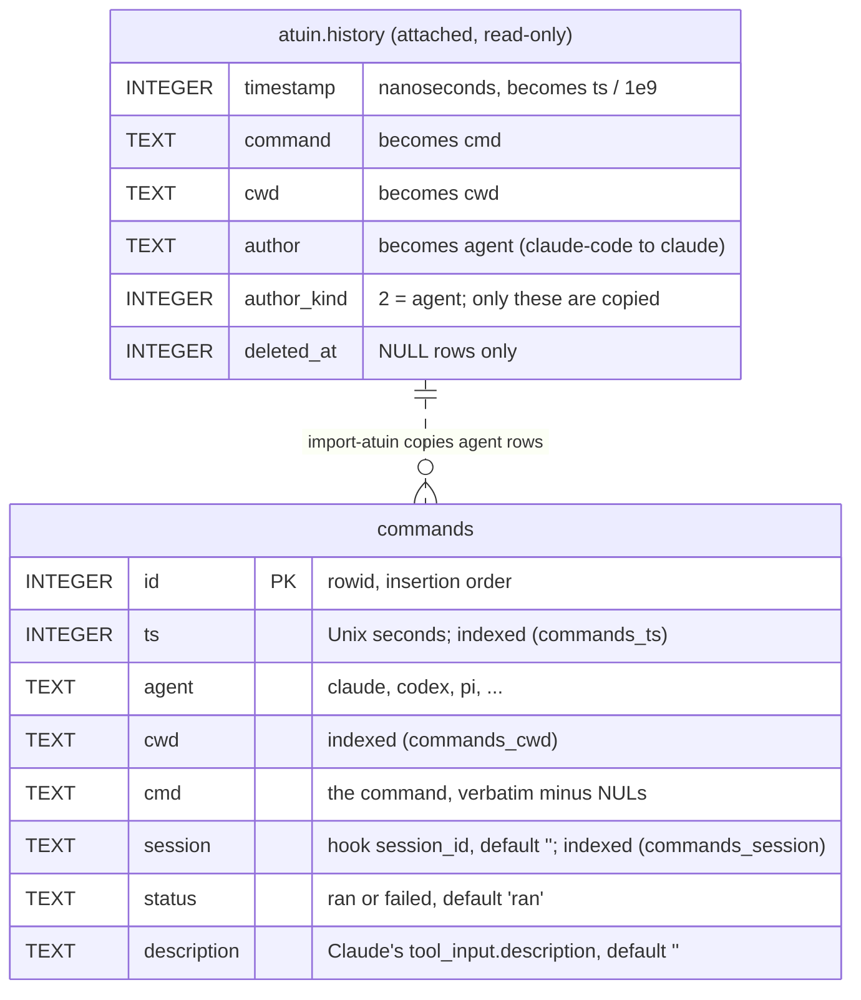

# zh

Shell commands run by coding agents (Claude Code, Codex, pi) are kept in their own SQLite history next to `.zsh_history` instead of inside it, so they never surface in up-arrow, substring search, or inline suggestions while staying searchable from the Ctrl-R widget in `config/zsh.d/zsh/config/extras.zsh`. `zh` is the recorder and query tool for that history: the Claude and Codex hooks and the pi `agent-history` extension call `zh record`, and the widget calls `list`, `show`, and `forget`. The package also installs `agent-history` as an alias of `zh` while callers move to the new name. It replaced a Bash script and keeps its subcommands, output bytes, exit codes, and SQLite schema. The schema is created with all its columns on first write; tables from before `session`, `status`, and `description` existed are not migrated, since no database with that schema is in use.

## Database

`$ZDOTDIR/.zh.db` (falling back to `$HOME` when `ZDOTDIR` is unset or empty), created with mode 0600 in WAL mode. One table holds every record; `import-atuin` reads atuin's `history` table from a separate database attached for the duration of the import.



Every column except `id` is `NOT NULL`. `status` is `failed` only for Claude's `PostToolUseFailure` hook events; Codex and pi always record `ran`. `list` reads `commands` newest first (`ts DESC, id DESC`), deduplicated by `cmd` unless `--all`, and hides `failed` rows unless `--all`; `stats` groups every row in scope by command prefix.

## Layout

| File | Role |
| --- | --- |
| `src/main.rs` | clap definitions, dispatch, exit codes |
| `src/db.rs` | database path, creation with mode 0600, busy timeout, schema creation |
| `src/record.rs` | hook payload parsing, credential filter, insert |
| `src/query.rs` | filters, `list`, `show`, `forget`, `stats`, `import-atuin` |
| `src/repo.rs` | jj/git root resolution for `--repo` |
| `tests/cli.rs` | integration tests that run the built binary against real SQLite |
| `tests/fixtures/` | synthetic database, atuin database, hook payloads, and the golden case list |
| `tests/golden/` | outputs the Bash implementation produced for each case |

Unit tests live next to the code in each file's `tests` module.

## Build and test

```sh
nix develop .#rust
cargo test
cargo clippy --all-targets -- -D warnings
cargo fmt --check
```

`nix build .#zh` and `nix flake check` build the package and run the same tests in the sandbox; `git` and `jujutsu` are check inputs because the `--repo` tests create repositories. Dependencies are pinned by `Cargo.lock`, which the Nix build reads directly, so there is no vendor hash to update.

## Golden tests

`tests/fixtures/cases.json` lists invocations; `tests/golden/<name>.json` holds the exit code, stdout, and stderr the Bash implementation gave for each run, plus the resulting rows where a case sets `rows`. The integration test replays every case against the binary and compares stdout and the unchanged stderr messages byte for byte. Argument errors and help are not in the golden files: their wording is clap's, and `tests/cli.rs` asserts their exit codes separately.

The fixtures are synthetic. Never add real history to them.

## Differences from the Bash implementation

- Argument errors are clap's messages; exit codes are unchanged (64 for a missing or unknown subcommand and for bad `stats --words`/`--limit` values, 1 for other argument errors).
- `-h`/`--help` prints help and exits 0 at the top level and for every subcommand.
- `forget` parses its argument like any other: a command starting with `-` needs `forget -- CMD`.
- The credential filter uses Rust's `regex`: simple case folding and Unicode word boundaries, so shapes like `PAßWORD=x` or a zero-width joiner before `TOKEN=` are recorded where jq's Oniguruma dropped them.
- A non-string `cwd`, `session_id`, or `description` in a payload is recorded as empty instead of failing the record, and NUL characters are removed from every field.
- Output to a closed pipe ends quietly with exit 0.
