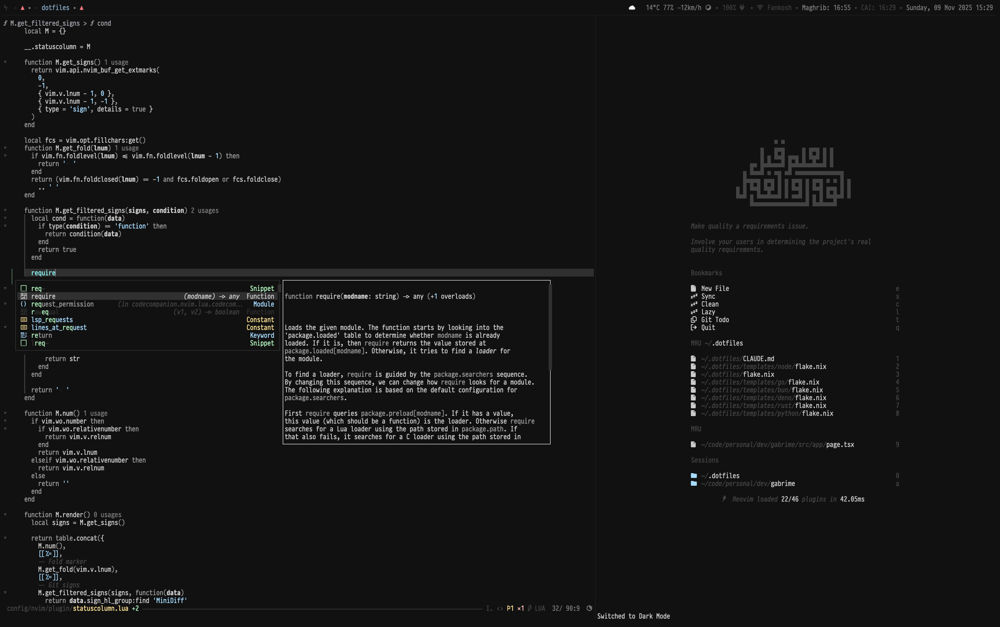

# My [.]files

For setting up development environment on new Mac. You are welcome to give tips on how can I improve this.

## Tools:

* Command line tools through [Xcode](https://itunes.apple.com/en/app/xcode/id497799835?mt=12) or from [Apple Developer website](https://developer.apple.com/downloads)
* [Prezto](https://github.com/sorin-ionescu/prezto)
* [Homebrew](http://mxcl.github.io/homebrew/)
    * [Git](http://git-scm.com/)
    * [Nodejs](http://nodejs.org/) with [NPM](https://npmjs.org/)
    * [Ruby](http://www.ruby-lang.org/en/) using [rbenv](https://github.com/sstephenson/rbenv/) & [Ruby build](https://github.com/sstephenson/ruby-build)  & [Ruby Gems](http://rubygems.org)
    * [Python](http://www.python.org/)

### Applications
* [iTerm](http://www.iterm2.com/)
* [Sublime Text 3](http://www.sublimetext.com/3)
* Browsers
    * [Google Chrome](https://www.google.com/intl/en/chrome/browser/)
    * [Google Chrome Canary](https://www.google.com/intl/en/chrome/browser/canary.html)
    * [Firefox](http://www.mozilla.org/en-US/firefox/new/)
    * [Firefox Nightly](http://nightly.mozilla.org/)
    * [Opera](http://www.opera.com/)
    * [Opera next](http://www.opera.com/computer/next)
* [VirtualBox](https://www.virtualbox.org/)
* [Caffeine](http://itunes.apple.com/us/app/caffeine/id411246225)
* [Alfred](http://www.alfredapp.com/)
* [AppCleaner](http://www.freemacsoft.net/appcleaner/)
* [Box Sync](http://box.com)
* [VLC Player](http://www.videolan.org/vlc/index.html)
* [Dash](https://itunes.apple.com/us/app/dash-docs-snippets/id458034879?mt=12)
* [ImageAlpha](http://pngmini.com/)
* [ImageOptim](http://imageoptim.com/)
* [Spectacle](http://spectacleapp.com/)
* [Sequel Pro](http://www.sequelpro.com/)
* [Sketch](http://www.bohemiancoding.com/sketch/)
* [Skype](http://www.skype.com/en/)
* [Tweetbot](https://itunes.apple.com/us/app/tweetbot-for-twitter/id557168941?mt=12)

#### From the App Store
* Wunderlist
* CloudApp
* Transmit
* Dash

## Installation

Change shell to `zsh`

    $ chsh -s $(which zsh)

Install Command line tools through [Xcode](https://itunes.apple.com/en/app/xcode/id497799835?mt=12) from the App Store

Install

    $ curl -sS https://raw.githubusercontent.com/ahmedelgabri/dotfiles/master/source/install | sh
